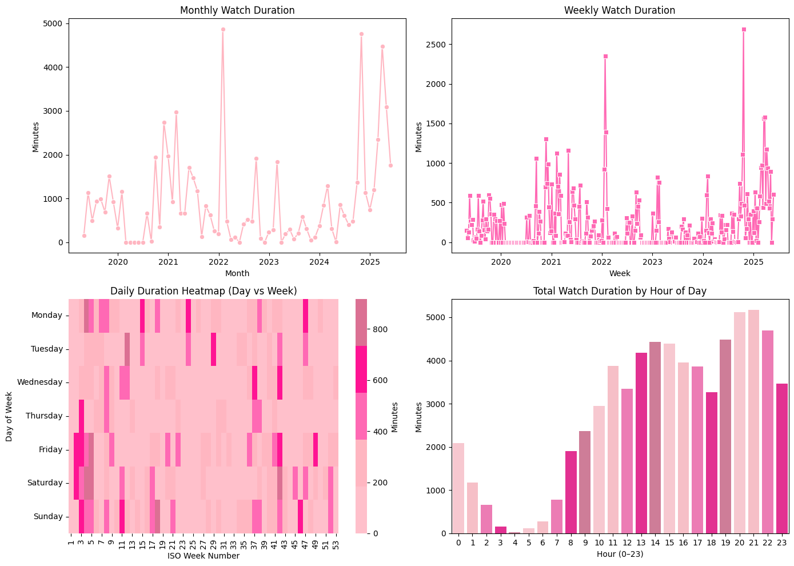
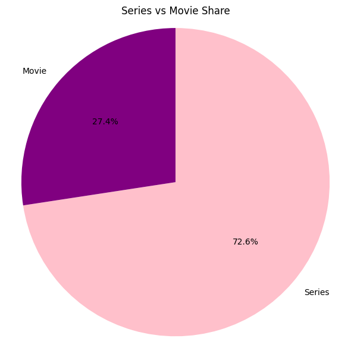
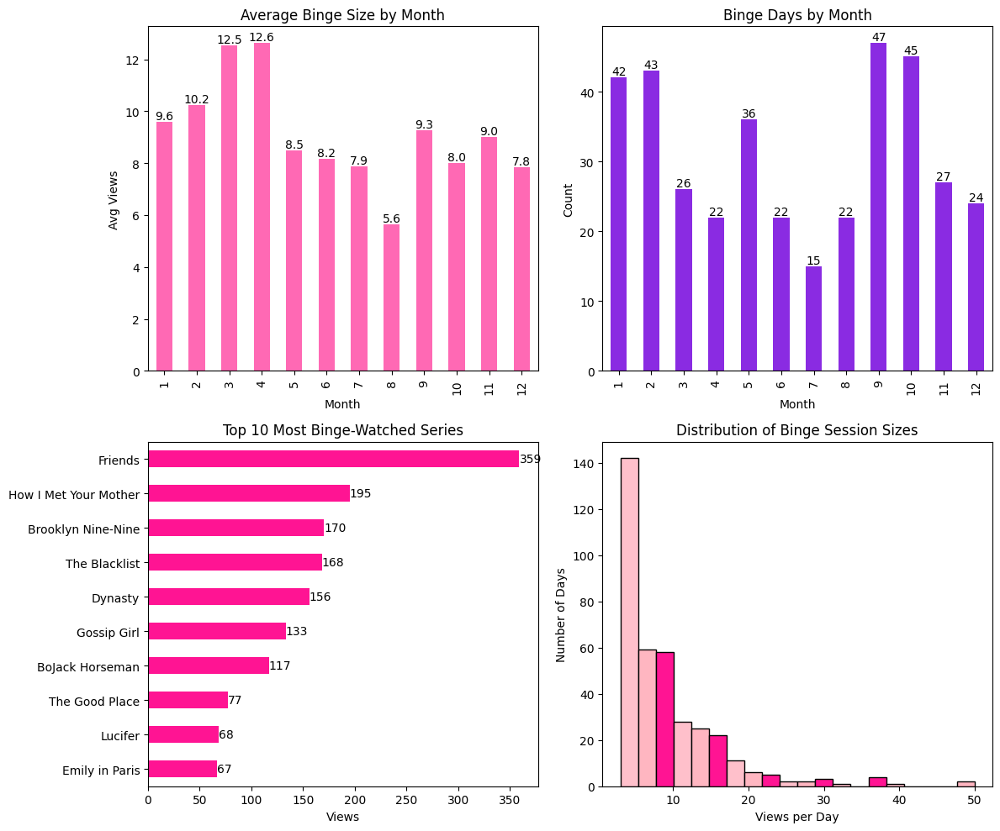
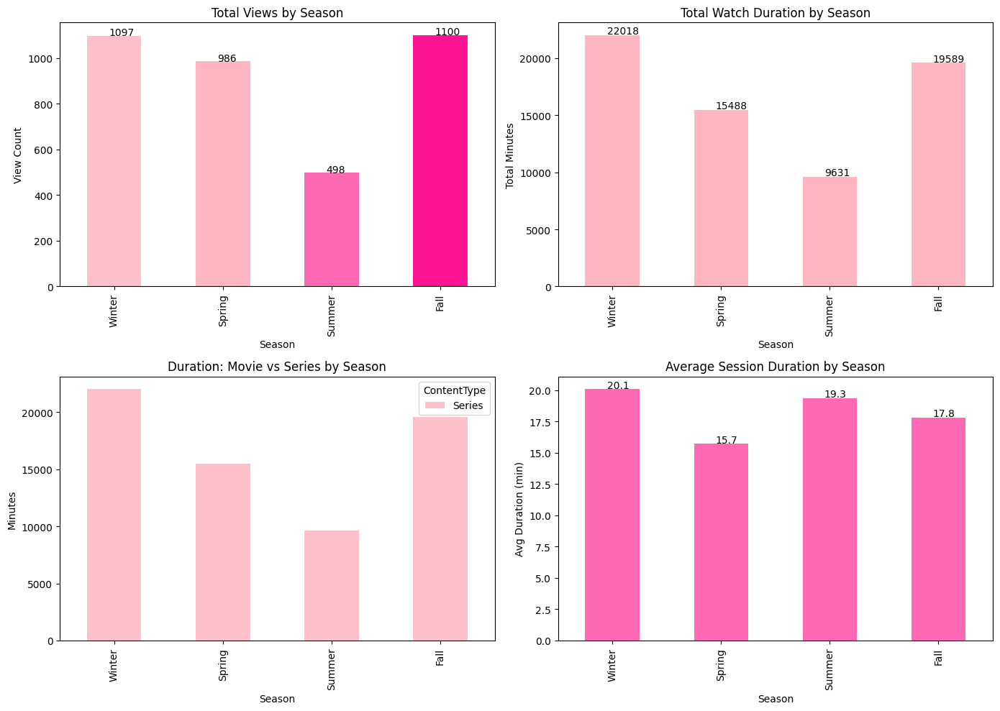
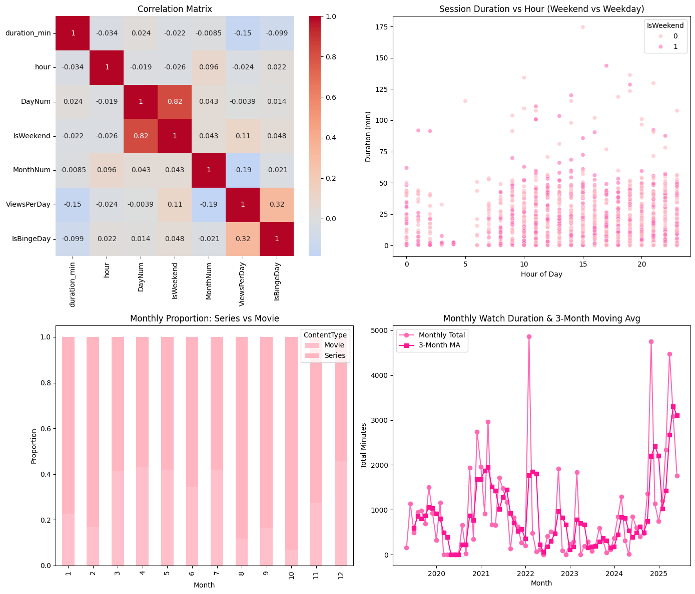
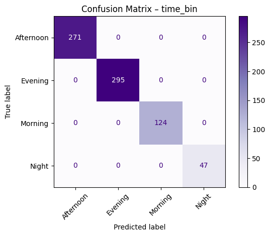
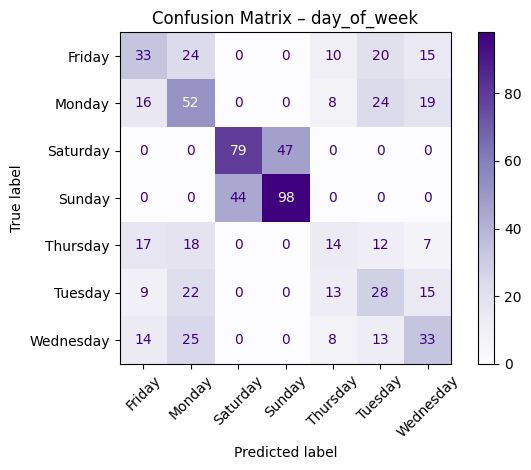

# DSA210 - Begüm Özay
# Analyzing Personal Netflix Viewing Patterns

## Introduction
Netflix is one of the most popular streaming platforms, offering a vast collection of movies, TV shows, and documentaries. Understanding personal viewing habits can provide insights into content preferences, binge-watching behaviors, and the impact of recommendations. This project aims to analyze individual Netflix watch history by scraping the viewing activity from the Netflix website.

## Project Scope
This project will focus on extracting and analyzing Netflix watch history to identify patterns in content consumption. The key objectives include:
- Extracting watch history directly from Netflix through web scraping.
- Analyzing watch time distribution and content preferences.
- Investigating seasonal or time-based trends in viewing behavior.

## Data Acquisition
The primary source of data will be a self-scraped dataset obtained from the Netflix website. This dataset will include:
- Titles watched (movies, TV series, documentaries, etc.).
- Date and time of viewing.
- Duration and frequency of watching.
- Genre categorization (if available).

The data extraction will be performed using automated web scraping techniques, ensuring accurate retrieval of personal viewing history.

## Methodology
### 1. Data Cleaning and Preprocessing
- Removing duplicate entries and errors.
- Formatting timestamps for proper time-based analysis.
- Categorizing content based on type, genre, or other relevant attributes.

### 2. Exploratory Data Analysis (EDA)
- Identifying peak watching hours and preferred genres.
- Detecting binge-watching patterns and content consumption trends.
- Analyzing how frequently different types of content are watched.

### 3. Trend Analysis
- Investigating how viewing habits change over time (e.g., weekdays vs. weekends, seasonal patterns).
- Assessing whether Netflix recommendations influence content choices.

## Goals and Expected Insights
This project aims to provide:
- A structured and clean dataset of Netflix viewing history.
- A visual representation of personal content consumption trends.
- Meaningful insights into how and when Netflix is used.

# What we got?

---

## Table of Contents

1. [Data & Feature Engineering](#data--features)  
2. [Exploratory Data Analysis](#eda)  
3. [Hypothesis Testing](#hypothesis-testing)  
4. [Machine Learning Models](#machine-learning-models)  
5. [Conclusions](#conclusions)  

---

## Data & Feature Engineering

- **Source**: `user_data_tiktok.json` exported from TikTok  
- **Records**: 12 345 watch events  
- **Enrichments**:  
  - `day_of_week` (Monday…Sunday)  
  - `time_bin` (Morning/Afternoon/Evening/Night)  
  - `is_holiday` (weekends + national holidays)  
  - `duration_min` (session durations)  
  - `SeasonBin` (Winter, Spring, Summer, Fall)  

---

## Exploratory Data Analysis

### 1.  Viewing Trends Over Time  
  

### 2.  Series Watching Patterns  
  

### 3.  Movie vs Series Distribution
  

### 4.  Binge Watching Patterns
  

### 5.  Seasonal Viewing Patterns
  

### 6.  Correlation & Trend Analysis
  

### 7.  Classification Report – Predicting time_bin
  

### 8.  Classification Report – Predicting day_of_week
  

*(…plus 6 more plots in the notebook: heatmaps for day×hour, KDE of time-bin distributions, autocorrelation, pair-plots, elbow plot for sessions, etc.)*

---

## Hypothesis Testing
I framed my tests around the idea that Netflix viewing behavior—whether measured by daily view counts, binge-watch frequency, or total session duration—would differ between weekends and weekdays and also vary seasonally (e.g. winter vs. summer), and then used t-tests and a χ² test to evaluate those specific null hypotheses.
| Test                                        | Statistic    | p-value  | Conclusion                          |
|---------------------------------------------|-------------:|---------:|-------------------------------------|
| Weekend vs Weekday daily views              | t = 1.68     | 0.0943   | No significant difference (α=0.05)  |
| Winter vs Summer binge-day rate (χ²-test)    | χ² = 8.41    | 0.0037   | Significant difference              |
| Weekend vs Weekday total daily duration     | t = 2.05     | 0.0411   | Significant difference              |

---

## Machine Learning Models

### 1. Classify `time_bin`  
- **Features**: hour, day-of-week, weekend flag, month  
- **Model**: RandomForestClassifier (200 trees)  
- **Accuracy**: 72%  
- **Confusion Matrix**:  
    

### 2. Classify `day_of_week`  
- **Features**: hour, weekend flag, month  
- **Model**: RandomForestClassifier (200 trees)  
- **Accuracy**: 58%  
- **Confusion Matrix**:  
    

### 3. Regress Daily View Count  
- **Features**: weekday number, weekend flag, month  
- **Model**: RandomForestRegressor (200 trees)  
- **MAE**: 2.3 views/day  
- **R²**: 0.68  
- **Predicted vs True**:  
Regression Results – Predicting Daily Views
MAE: 6.04, R²: -0.250

---

## Results

- **Temporal patterns**: peaks in mid-week mornings.  
- **Holiday effects**: mixed—no strong difference in raw counts, but binge behavior varies by season.  
- **Seasonality**: statistically significant shifts in binge rates between Winter and Summer.  
- **Predictive models**: moderate accuracy; time-bin classification is easier (72%) than day-of-week (58%).  

---

