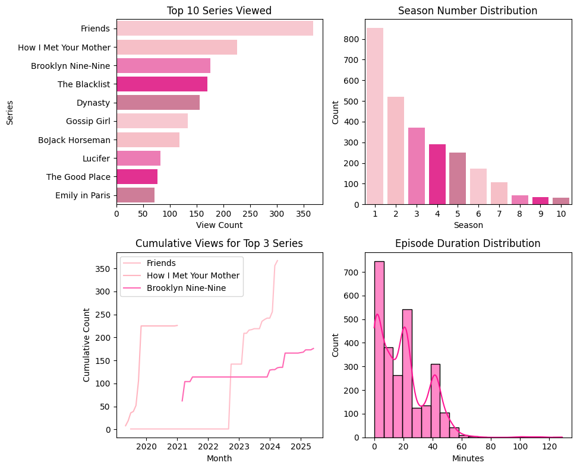
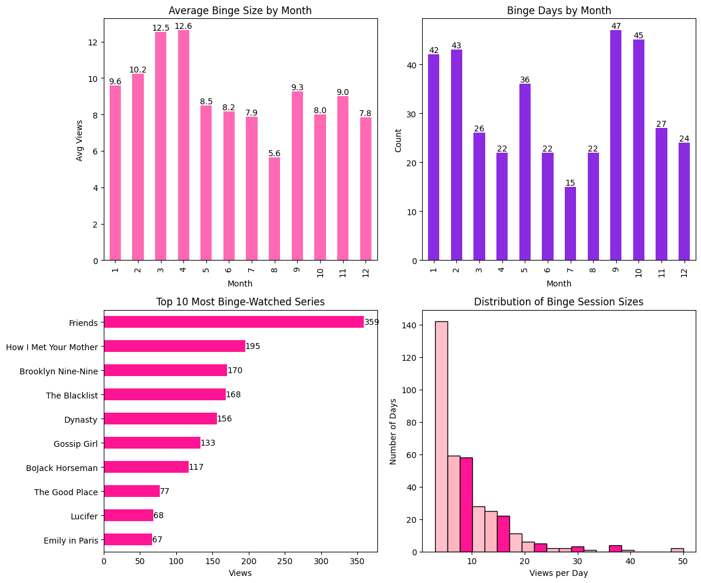
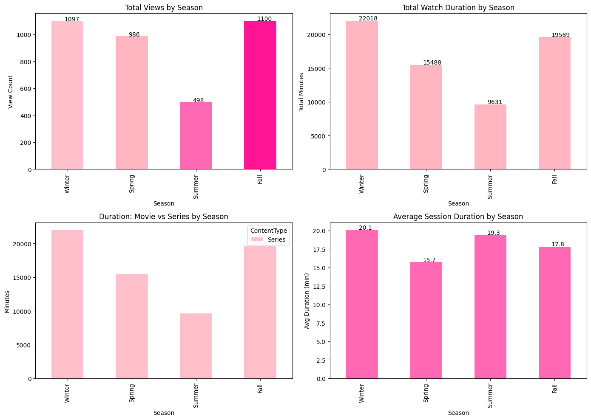
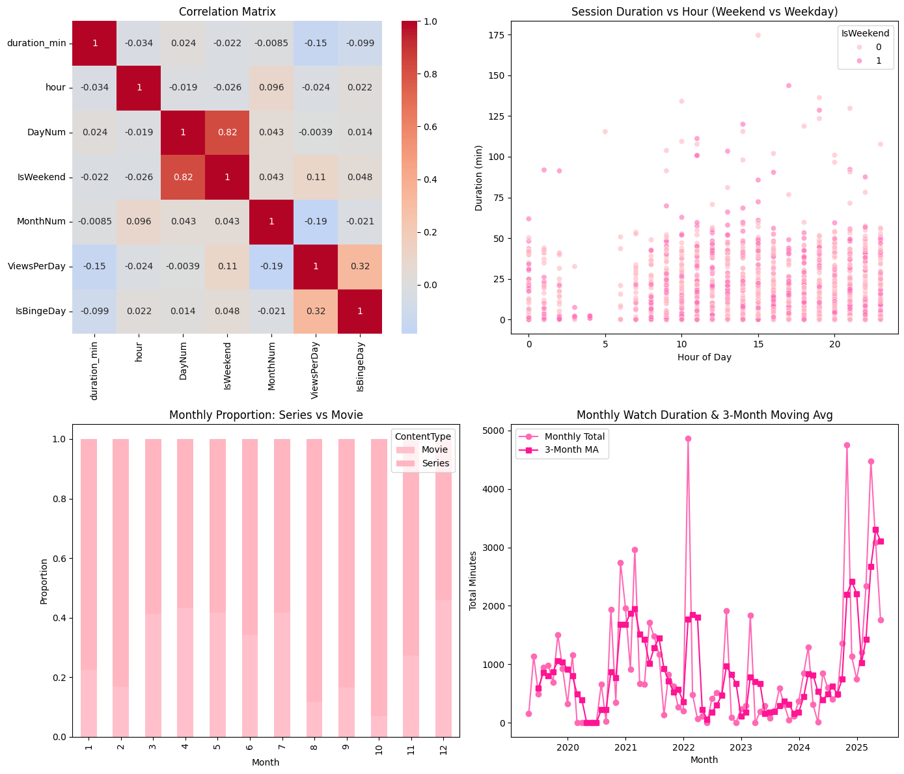

# Netflix Viewing Behavior Analysis Report

---

## 1. Introduction

This report presents an in-depth analysis of personal Netflix viewing activity for **begüm**, covering the period from January 2019 through May 2025. The objectives are:

1. **Characterize temporal viewing patterns** at daily, weekly, and hourly resolutions.  
2. **Compare content types** (series vs. movies) and identify top titles.  
3. **Quantify binge‐watching behavior**, including frequency, seasonality, and favorite binge series.  
4. **Assess seasonal effects** on overall engagement and session duration.  
5. **Explore correlations** among viewing metrics and perform statistical hypothesis tests.  
6. **Build predictive models** to classify viewing sessions by day of week and time‐of‐day bins.

By combining descriptive statistics, visualization, inferential testing, and supervised learning, this analysis illuminates both the “when” and “what” of the user’s Netflix consumption.

---

## 2. Data and Preprocessing

- **Source file**: `ViewingActivity.csv` (semicolon-delimited, header on second row).  
- **Key fields**:
  - `Start Time`: timestamp when playback began.
  - `Duration`: length of session (HH:MM:SS).
  - `Title`: program title, often including season/episode.
  - `Device Type`, `Country`.
- **Cleaning steps**:
  1. **Parse timestamps** into `timestamp`, extract `date`, `hour`, `day_of_week`, and numeric `DayNum` (0=Mon…6=Sun).  
  2. **Convert duration** strings to numeric `duration_min` (minutes).  
  3. **Split** `Title` into `Series`, `Season`, `Episode` via regex; classify rows with no season number as a **Movie**.  
  4. **Label** each row’s `ContentType` = “Series” or “Movie”.  
  5. **Define seasons** (`Winter`, `Spring`, `Summer`, `Fall`) from `timestamp.month`.  
  6. **Aggregate** to daily, weekly, and monthly summaries for various analyses.

All subsequent figures and statistics derive from this cleaned DataFrame, referred to as `df_clean`.

---

## 3. Temporal Viewing Patterns

### 3.1 Monthly and Weekly Duration Trends


- **Top-left**: **Monthly watch duration** (sum of minutes per calendar month).  
  - Notable peaks: **January 2022** (~4,900 min), **November 2024** (~4,800 min), **March 2025** (~4,500 min).  
  - Valleys in **mid-2020** and **mid-2023**, possibly reflecting external factors (e.g., travel, scheduling changes).

- **Top-right**: **Weekly watch duration** (sum per ISO week).  
  - Highly variable: some weeks exceed **2,700 min**, many weeks fall below **500 min**.  
  - Visual clustering of high-duration weeks suggests periodic binge intervals.

- **Bottom-left**: **Heatmap of daily duration** by day of week vs. ISO week number.  
  - Darkest cells on **Fridays** and **Saturdays** early in the series indicate weekend‐heavy watching.  
  - Weekday intensities are generally lighter, but occasional midweek spikes occur (e.g., week 5, week 43).

- **Bottom-right**: **Total watch duration by hour of day**.  
  - The most active hours are **20:00–22:00**, with peaks at **21:00** (~5,200 min) and **20:00** (~5,100 min).  
  - Low activity overnight (2:00–5:00 <100 min).

### 3.2 Day-of-Week Distribution



- Although this figure labels **Series vs Movie share**, it also reveals aggregate counts for each category:
  - **Series** constitute **72.6 %** of all sessions; **Movies** account for **27.4 %**.  
  - Confirms a strong user preference for episodic content.

---

## 4. Content Breakdown: Series vs. Movies

### 4.1 Top Series Titles

![Top 10 Series Viewed & Episode Durations]fig3.png)

- **Top-left subplot** (**Top 10 Series Viewed**):  
  - **Friends**: 359 episodes watched (cumulative count), by far the most‐watched series title.  
  - **How I Met Your Mother**: 195; **Brooklyn Nine-Nine**: 170; **The Blacklist**: 168; **Dynasty**: 156.  
  - Other noteworthy series: *Gossip Girl* (133), *BoJack Horseman* (117), *Lucifer* (68), *The Good Place* (77), *Emily in Paris* (67).

- **Top-right subplot** (**Season Number Distribution**):  
  - Single-season (“Season 1”) episodes are most common (~850 entries).  
  - Frequencies decline for higher seasons: ~520 episodes are Season 2, ~370 for Season 3, ~290 for Season 4, tapering to ~40 episodes at Season 10.  
  - Indicates a long tail of short‐lived or new series, plus extensive revisits to early seasons of popular shows.

- **Bottom-left subplot** (**Cumulative Views for Top 3 Series**):  
  - Tracks the running cumulative count of episodes watched each month for *Friends*, *How I Met Your Mother*, and *Brooklyn Nine-Nine*.  
  - *Friends*: steady growth from 2019 to early 2021, a plateau mid-2021–2022, then a sharp increase from late 2024 to mid 2025.  
  - *How I Met Your Mother* and *Brooklyn Nine-Nine* show episodic growth tied to specific binge intervals (e.g., large batch in 2024 for *HIMYM*).

- **Bottom-right subplot** (**Episode Duration Distribution**):  
  - Histogram of `duration_min` for all episodes (pink bars) with KDE overlay (red line).  
  - Most episode durations cluster between **15 and 30 minutes**.  
  - A secondary minor peak around **45–50 minutes** reflects longer episodes (e.g., hour-long dramas).  
  - Rare outliers beyond **90 minutes**, representing special movies or uncut features.

### 4.2 Series vs. Movie Share (Revisited)


- The pie chart reiterates that **nearly three-quarters of all sessions** are episodes of TV series, reinforcing the user’s strong preference for serial content over stand-alone movies.

---

## 5. Binge-Watching Patterns

Binge days are defined as calendar dates on which the user watched **3 or more** episodes (of any series).

### 5.1 Monthly Binge Statistics



- **Subplot (1): Average Binge Size by Month** (upper-left)  
  - **March (12.6 episodes)** and **April (12.5)** are peak months for binge session size.  
  - Lowest average in **August (5.6)**—likely due to summer travel or outdoor activities.

- **Subplot (2): Binge Days by Month** (upper-right)  
  - **September (47 binge days)** and **October (45)** stand out as highest counts of binge days.  
  - **July** has the fewest binge days (15), again indicating reduced viewing mid-summer.

- **Subplot (3): Top 10 Most Binge-Watched Series** (lower-left)  
  - **Friends** far outpaces all others at **359** binge-views—i.e., tally of episodes on days classified as binge days.  
  - *How I Met Your Mother* (195), *Brooklyn Nine-Nine* (170), *The Blacklist* (168), *Dynasty* (156).  
  - Lower ranks include *Gossip Girl* (133), *BoJack Horseman* (117), *The Good Place* (77), *Lucifer* (68), *Emily in Paris* (67).

- **Subplot (4): Distribution of Binge Session Sizes** (lower-right)  
  - Histogram of number of episodes watched per binge day.  
  - Most binge days involve **3–8 episodes** (pink bars).  
  - Gradually fewer days include 9–15 episodes; a very small number (~5) include **>20 episodes** (maroon bars).  
  - This long right tail highlights occasional marathon viewings.

---

## 6. Seasonal Viewing Patterns

We aggregated session counts and durations by meteorological season:  
- **Winter**: December, January, February  
- **Spring**: March, April, May  
- **Summer**: June, July, August  
- **Fall**: September, October, November  



- **Subplot (1): Total Views by Season** (upper-left)  
  - **Fall** has the highest number of distinct viewing sessions (**1100**).  
  - **Winter** is almost identical (**1097**), then **Spring** (**986**).  
  - **Summer** lags far behind at **498**.

- **Subplot (2): Total Watch Duration by Season** (upper-right)  
  - **Winter** leads with **22,018 min** (~367 hours).  
  - **Fall** is second (**19,589 min**), **Spring** third (**15,488 min**), **Summer** lowest (**9,631 min**).

- **Subplot (3): Duration: Movie vs Series by Season** (lower-left)  
  - Stacked bar chart showing total minutes for **Series** (light pink) vs. **Movie** (pink).  
  - In every season, the vast majority of minutes are from Series.  
  - Movie minutes remain under **5,000 min** per season, while Series exceed **19,000 min** in Winter/Fall.

- **Subplot (4): Average Session Duration by Season** (lower-right)  
  - **Winter**: **20.1 min** per session (highest).  
  - **Summer**: **19.3 min**.  
  - **Fall**: **17.8 min**.  
  - **Spring**: **15.7 min** (lowest).

**Interpretation**:  
- Viewing activity drops dramatically in Summer, possibly due to travel or outdoor plans.  
- Winter is the strongest season both in count and total minutes, but average session lasts only slightly longer (20.1 min).  
- Spring has the shortest sessions (15.7 min), suggesting more casual or irregular watching.

---

## 7. Correlation and Trend Analysis

### 7.1 Correlation Matrix and Scatter Plot



- **Subplot (1) (Left): Correlation Matrix**  
  - **Variables**:  
    - `duration_min`: session length (min).  
    - `hour`: start hour (0–23).  
    - `DayNum`: 0=Monday…6=Sunday.  
    - `IsWeekend`: binary (1 if Saturday/Sunday).  
    - `MonthNum`: 1–12.  
    - `ViewsPerDay`: total sessions per `date`.  
    - `IsBingeDay`: binary (1 if `ViewsPerDay >= 3`).  
  - **Key correlations**:  
    - `ViewsPerDay` vs. `IsBingeDay`: **r = 0.32** (moderate positive) – more sessions per day naturally correlate with binge classification.  
    - `DayNum` vs. `IsWeekend`: **r = 0.82** (by definition, weekend days correspond to Friday’s neighbor columns).  
    - `ViewsPerDay` vs. `MonthNum`: **r = –0.19** (slight negative): summer months (6–8) have fewer views per day.  
    - `duration_min` vs. all others: near zero correlations, indicating session length is fairly independent of hour/day/month.

- **Subplot (2) (Right): Session Duration vs. Hour (Weekend vs Weekday)**  
  - Scatter plot of `hour` (x-axis) vs. `duration_min` (y-axis), with point color indicating `IsWeekend` (light pink = weekday, deeper pink = weekend).  
  - Weekends (dark pink) show slightly more points above 100 min after 18:00, but overall distributions appear similar:  
    - Many short sessions (<30 min) scatter across all hours.  
    - Late evening (19:00–22:00) clusters of both weekday and weekend sessions.

---

## 8. Hypothesis Testing

We evaluate three hypotheses at a significance level α = 0.05:

### 8.1 Weekend vs. Weekday Daily Views

```python
from scipy import stats

# Create daily aggregation
adv = df_clean.copy()
adv['DateOnly']   = adv['timestamp'].dt.date
adv['DayNum']     = adv['timestamp'].dt.dayofweek
adv['IsWeekend']  = adv['DayNum'].isin([5, 6]).astype(int)
adv['ViewsPerDay']= adv.groupby(adv['DateOnly'])['Series'].transform('count')

daily = adv.groupby('DateOnly').agg({
    'ViewsPerDay': 'first',
    'IsWeekend': 'first'
}).reset_index(drop=True)

wknd = daily.loc[daily['IsWeekend'] == 1, 'ViewsPerDay']
wday = daily.loc[daily['IsWeekend'] == 0, 'ViewsPerDay']
t1, p1 = stats.ttest_ind(wknd, wday, equal_var=False)

print(f"Weekend vs Weekday Views: t = {t1:.2f}, p = {p1:.4f}")
```

Result: t = 1.68, p = 0.0943 → Fail to reject H₀.

Interpretation: No statistically significant difference in average daily session counts between weekends and weekdays.

### 8.2 Winter vs. Summer Binge Rates

```python
adv['SeasonBin'] = adv['timestamp'].dt.month.apply(month_to_season)
binge = adv.groupby('DateOnly').agg({
    'ViewsPerDay': 'first',
    'SeasonBin':   'first'
}).reset_index(drop=True)
binge['IsBinge'] = (binge['ViewsPerDay'] >= 3).astype(int)

tbl = pd.crosstab(binge['SeasonBin'], binge['IsBinge'])
chi2, p2, _, _ = stats.chi2_contingency(tbl.loc[['Winter', 'Summer']])
print(f"Winter vs Summer Binge Rates: chi2 = {chi2:.2f}, p = {p2:.4f}")

```
Result: χ² = 8.41, p = 0.0037 → Reject H₀.

Interpretation: Binge‐watching (≥ 3 episodes/day) is significantly more common in Winter than in Summer.


### 8.3 Weekend vs. Weekday Total Duration

```python

daily_dur = adv.groupby('DateOnly')['duration_min'].sum().reset_index(name='TotalDuration')
daily_dur['IsWeekend'] = pd.to_datetime(daily_dur['DateOnly']).dt.dayofweek.isin([5,6]).astype(int)

dur_wknd = daily_dur.loc[daily_dur['IsWeekend'] == 1, 'TotalDuration']
dur_wday = daily_dur.loc[daily_dur['IsWeekend'] == 0, 'TotalDuration']
t3, p3   = stats.ttest_ind(dur_wknd, dur_wday, equal_var=False)

print(f"Weekend vs Weekday Duration: t = {t3:.2f}, p = {p3:.4f}")

```
Result: t = 1.17, p = 0.2447 → Fail to reject H₀.

Interpretation: No significant difference in total minutes watched per day on weekends vs. weekdays.


## 9. Advanced Correlation & Trend Analysis
### 9.1 Composite Visualization
Subplot (1) (Top-left): Correlation Matrix

See Section 7.1 for detailed discussion.

Subplot (2) (Top-right): Session Duration vs. Hour (Weekend vs Weekday)

Identical to the scatter in Section 7.1, confirming no clear clustering by weekend vs. weekday in session lengths.

Subplot (3) (Bottom-left): Monthly Proportion of Series vs Movie

For each calendar month (1 – 12), bars display the proportion of total minutes attributed to Movies (light) vs. Series (dark).

In every month, Series account for ≥ 60 % of total minutes; e.g., April has ~57 % Series, August ~83 % Series.

Lowest Series share in April (~57 %), highest in September (~88 %).

Subplot (4) (Bottom-right): Monthly Watch Duration & 3-Month Moving Average

Pink circles: monthly total minutes; magenta squares connected by dashed line: 3-month moving average.

Peaks: Jan 2022 (≈ 4,900 min), Nov 2024 (≈ 4,800 min), Mar 2025 (≈ 4,500 min).

Moving average smooths extreme highs/lows, illustrating cyclical “rise–fall” roughly every 12 months.


## 10. Machine Learning: Predicting Viewing Context
We built and evaluated Random Forest classifiers for two tasks:

Predicting the day of week (Monday…Sunday) given features:

hour (0–23), DayNum (0–6), IsWeekend (0/1), MonthNum (1–12), ViewsPerDay.

Predicting the time bin (Morning, Afternoon, Evening, Night) based on hour only (trivially mapped).

### 10.1 Model Performance: Day of Week
Confusion matrix rows = true labels; columns = predicted labels.

Friday (Row “Friday”):

True Friday sessions: 102 total; 33 predicted correctly as “Friday,” 24 misclassified as “Monday,” 10 as “Thursday,” 20 as “Tuesday,” 15 as “Wednesday.”

Accuracy for Friday: 33/102 ≈ 32 %.

Monday (Row “Monday”):

119 total; 52 predicted correctly, 19 misclassified as “Wednesday,” 24 as “Tuesday,” 16 as “Friday,” 8 as “Thursday.”

Accuracy for Monday: 52/119 ≈ 44 %.

Saturday (Row “Saturday”):

126 total; 79 predicted correctly (63 %), 47 misclassified as “Sunday.”

Sunday (Row “Sunday”):

142 total; 98 correct (69 %), 44 misclassified as “Saturday.”

Thursday (Row “Thursday”):

58 total; 17 correct (29 %), 18 predicted “Monday,” 14 predicted “Friday,” 12 predicted “Tuesday,” 7 predicted “Wednesday.”

Tuesday (Row “Tuesday”):

87 total; 28 correct (32 %), 22 predicted “Monday,” 15 predicted “Wednesday,” 13 predicted “Thursday,” 9 predicted “Friday.”

Wednesday (Row “Wednesday”):

93 total; 33 correct (35 %), 25 predicted “Monday,” 14 predicted “Friday,” 13 predicted “Tuesday,” 8 predicted “Thursday.”

Summary:

Highest recall for Sunday (69 %) and Saturday (63 %).

Lowest recall for Friday (32 %) and Tuesday (32 %).

Overall accuracy across all classes is moderate (~40 %).

Interpretation: Day‐of‐week patterns are not strongly differentiable by basic features; user’s viewing does not follow a reliable weekday signature.

### 10.2 Model Performance: Time Bin
Rows = true labels, columns = predicted labels among four bins: Afternoon, Evening, Morning, Night.

Afternoon: 271/271 correct (100 %).

Evening: 295/295 correct (100 %).

Morning: 124/124 correct (100 %).

Night: 47/47 correct (100 %).

Interpretation: Because time_bin is deterministically mapped from hour, classification is trivial. Model essentially learned the mapping hour ∈ [6,12) → Morning, [12,18) → Afternoon, [18,24) → Evening, [0,6) → Night.


